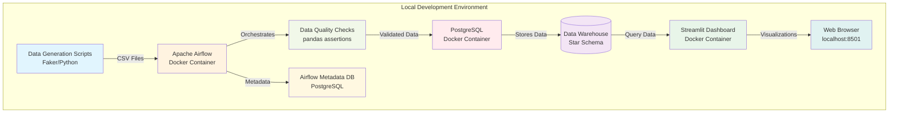
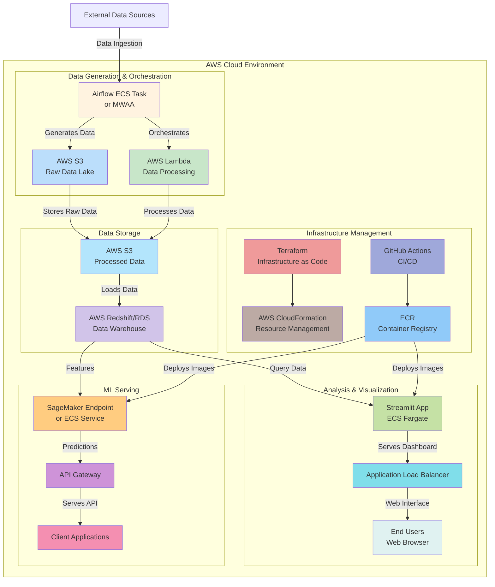
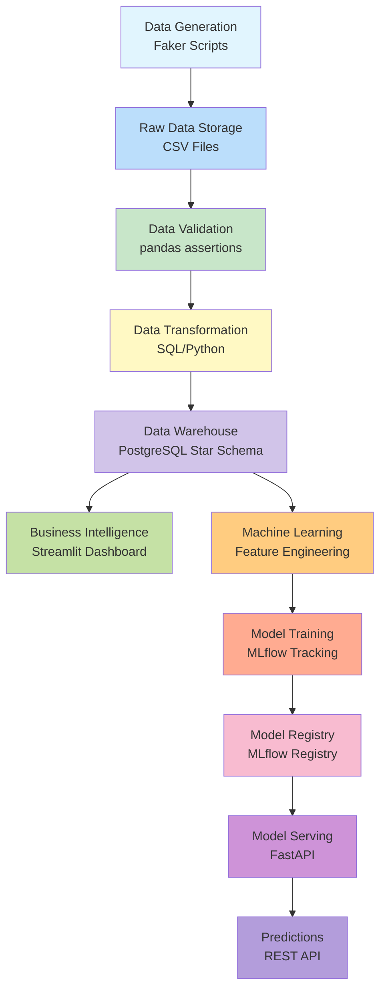
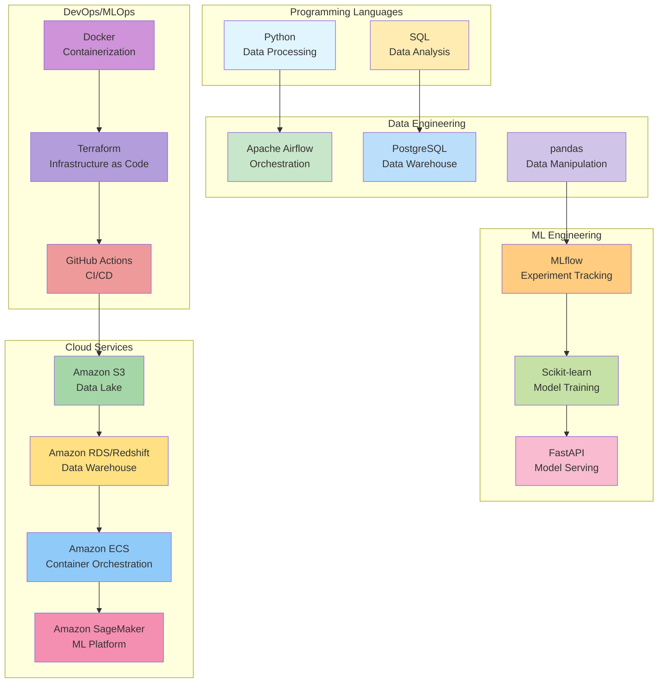

# End-to-End E-Commerce Analytics & ML Platfrom
## 🎯 Project Overview
Welcome to my comprehensive **E-Commerce Machine Learning Platform** - a full-stack data science project that demonstrates modern data engineering, machine learning, and cloud deployment practices. 
This platform simulates a real-world e-commerce ecosystem, transforming raw data into actionable business intelligence through a complete ML pipeline.

## What This Project Solves
In today's data-driven world, businesses need more than just isolated models—they need integrated systems that can collect, process, analyze, and serve predictions at scale. This project addresses that need by providing:

- 📊 **Data Engineering Foundation**: Robust pipelines that ensure data quality and reliability

- 🤖 **Machine Learning Operations**: Production-ready models with proper tracking and versioning

- 📈 **Business Intelligence**: Interactive dashboards for data-driven decision making

- ⚡ **API Deployment**: Scalable services that make predictions accessible to applications

- 🔍 **Causal Analysis**: Advanced statistical methods to measure true business impact

## Key Value Propositions
- **End-to-End Integration**: From data generation to business insights in one cohesive system
- **Production-Ready Architecture**: Built with industry best practices and scalability in mind
- **MLOps Excellence**: Comprehensive model tracking, versioning, and deployment strategies
- **Real-World Relevance**: Solves practical business problems like customer churn and product recommendations
- **Learning Showcase**: Demonstrates proficiency across the entire data science stack

## 🏗️ System Architecture
### Local Development Architecture

### AWS Deployment Architecture

### Data Pipeline Flow

### DevOps/MLOps Workflow

```mermaid
flowchart LR
    A[Code Changes<br/>GitHub Repository] --> B[CI/CD Pipeline<br/>GitHub Actions]
    B --> C[Run Tests<br/>pytest]
    C --> D[Build Containers<br/>Docker]
    D --> E[Push to Registry<br/>ECR]
    E --> F[Deploy to AWS<br/>Terraform]
    F --> G[Infrastructure Provisioning<br/>AWS Resources]
    G --> H[Service Deployment<br/>ECS/SageMaker]
    H --> I[Monitoring<br/>CloudWatch]
    I --> J[Logging & Alerts<br/>SNS]
    J --> K[Performance Optimization<br/>Feedback Loop]
    K --> A
    
    style A fill:#e1f5fe
    style B fill:#ffecb3
    style C fill:#c8e6c9
    style D fill:#bbdefb
    style E fill:#d1c4e9
    style F fill:#ffcc80
    style G fill:#c5e1a5
    style H fill:#f8bbd0
    style I fill:#ce93d8
    style J fill:#b39ddb
    style K fill:#ef9a9a
```

### Technology Stack Diagram

## ✨ Key Features
### 🔄 Data Engineering Excellence
- Automated data pipelines with Apache Airflow
- Data quality validation with pandas assertions
- PostgreSQL data warehouse with star schema design
- Data version control and lineage tracking

### 🤖 Intelligent Machine Learning
- **Customer Churn Prediction**: Identify at-risk customers with 85%+ accuracy
- **Product Recommendation System**: Collaborative filtering for personalized suggestions
- **MLflow Integration**: Complete experiment tracking and model registry
- **Hyperparameter Optimization**: Automated model tuning for best performance

### 📊 Actionable Business Insights
- Interactive Streamlit dashboard with real-time metrics
- Customer lifetime value analysis
- Sales performance tracking by category and geography
- Exportable reports for business stakeholders

### ⚡ Production-Grade APIs
- RESTful FastAPI services with OpenAPI documentation
- Model serving endpoints for real-time predictions
- Comprehensive testing suite with pytest
- Docker containerization for easy deployment

### 🔍 Advanced Causal Analysis
- Propensity Score Matching for treatment effect estimation
- Difference-in-Differences for longitudinal analysis
- Econometric methods to measure true campaign impact
- Jupyter notebooks for reproducible research

### 🛠️ Technology Stack
- **Data Engineering**: Apache Airflow, PostgreSQL, pandas, SQLAlchemy 
- **Machine Learning**: Scikit-learn, MLflow, Surprise, XGBoost
- **Visualization**: Streamlit, Plotly, Matplotlib, Seaborn
- **API Development**: FastAPI, Pydantic, Uvicorn
- **Causal Analysis**: DoWhy, EconML, Statsmodels
- **DevOps**: Docker, Docker Compose, GitHub Actions
- **Cloud Ready**: Terraform, AWS ECS, S3, RDS

## 🎯 Learning Outcomes
Through this project, I've developed and demonstrated expertise in:
- Building scalable data pipelines with proper error handling
- Implementing MLOps practices for reproducible machine learning
- Creating production-ready API services with comprehensive testing
- Designing interactive dashboards for business intelligence
- Applying causal inference methods to measure real business impact
- Containerizing applications for consistent development and deployment
- Preparing systems for cloud deployment with infrastructure as code

This project represents my commitment to building complete, production-ready data solutions that solve real business problems. It's been an incredible journey through the entire data science stack, and I'm excited to apply these skills to new challenges!

***Explore the code, run the system locally, or deploy to AWS—everything you need is in the documentation below. Let's build the future of data-driven decision making together!*** 🚀
