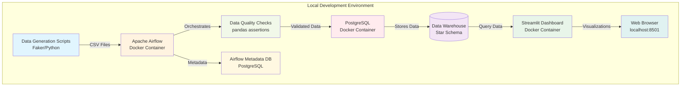
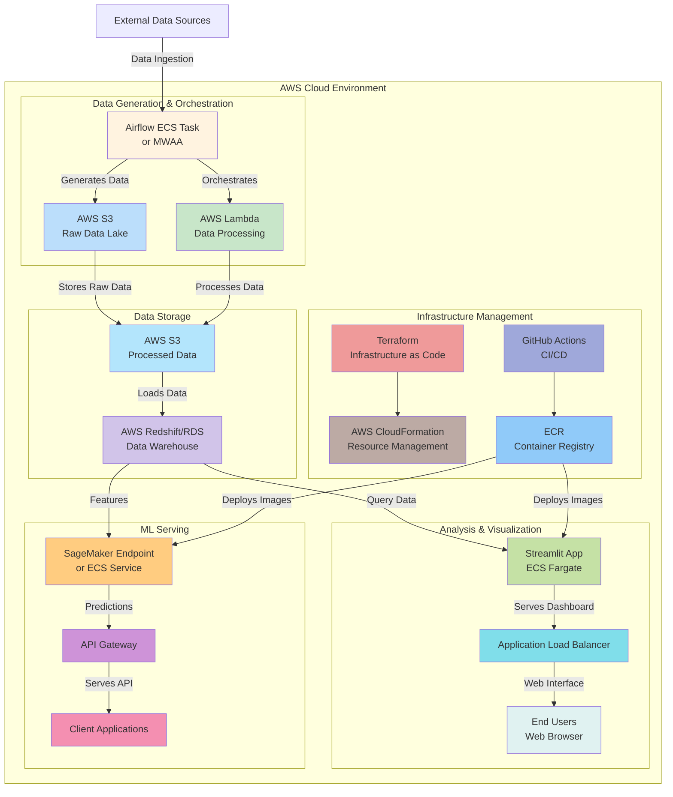
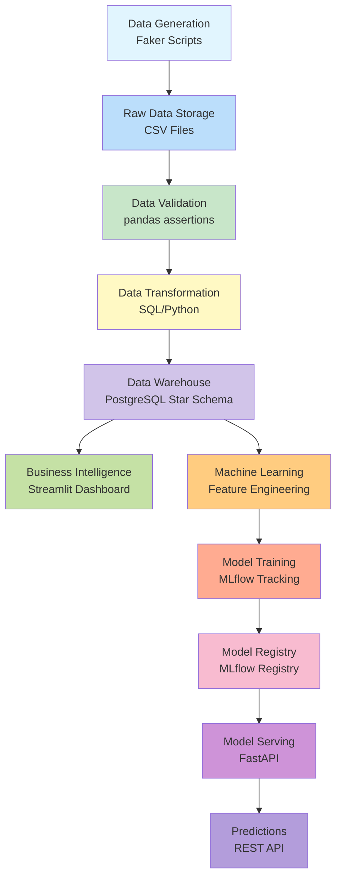
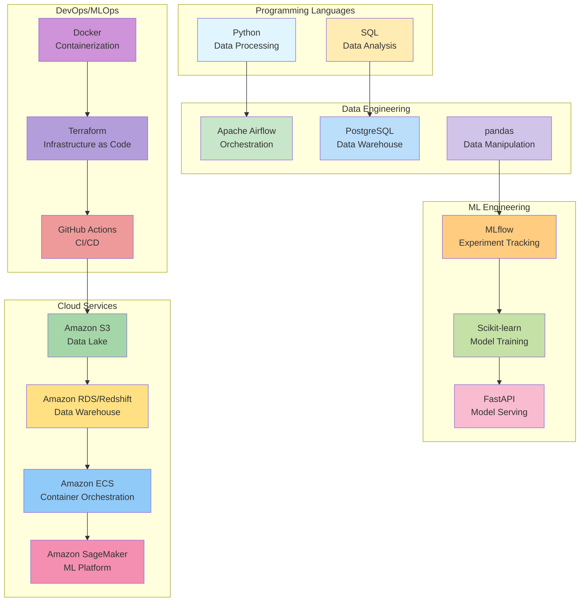

# End-to-End E-Commerce Analytics & ML Platform
# 🎯 Project Overview
Welcome to my comprehensive **E-Commerce Machine Learning Platform** - a full-stack data science project that demonstrates modern data engineering, machine learning, and cloud deployment practices. 
This platform simulates a real-world e-commerce ecosystem, transforming raw data into actionable business intelligence through a complete ML pipeline.

## What This Project Solves
In today's data-driven world, businesses need more than just isolated models—they need integrated systems that can collect, process, analyze, and serve predictions at scale. This project addresses that need by providing:

- 📊 **Data Engineering Foundation**: Robust pipelines that ensure data quality and reliability

- 🤖 **Machine Learning Operations**: Production-ready models with proper tracking and versioning

- 📈 **Business Intelligence**: Interactive dashboards for data-driven decision making

- ⚡ **API Deployment**: Scalable services that make predictions accessible to applications

- 🔍 **Causal Analysis**: Advanced statistical methods to measure true business impact

## Key Value Propositions
- **End-to-End Integration**: From data generation to business insights in one cohesive system
- **Production-Ready Architecture**: Built with industry best practices and scalability in mind
- **MLOps Excellence**: Comprehensive model tracking, versioning, and deployment strategies
- **Real-World Relevance**: Solves practical business problems like customer churn and product recommendations
- **Learning Showcase**: Demonstrates proficiency across the entire data science stack

## 🏗️ System Architecture
### Local Development Architecture

### AWS Deployment Architecture

### Data Pipeline Flow

### DevOps/MLOps Workflow

```mermaid
flowchart LR
    A[Code Changes<br/>GitHub Repository] --> B[CI/CD Pipeline<br/>GitHub Actions]
    B --> C[Run Tests<br/>pytest]
    C --> D[Build Containers<br/>Docker]
    D --> E[Push to Registry<br/>ECR]
    E --> F[Deploy to AWS<br/>Terraform]
    F --> G[Infrastructure Provisioning<br/>AWS Resources]
    G --> H[Service Deployment<br/>ECS/SageMaker]
    H --> I[Monitoring<br/>CloudWatch]
    I --> J[Logging & Alerts<br/>SNS]
    J --> K[Performance Optimization<br/>Feedback Loop]
    K --> A
    
    style A fill:#e1f5fe
    style B fill:#ffecb3
    style C fill:#c8e6c9
    style D fill:#bbdefb
    style E fill:#d1c4e9
    style F fill:#ffcc80
    style G fill:#c5e1a5
    style H fill:#f8bbd0
    style I fill:#ce93d8
    style J fill:#b39ddb
    style K fill:#ef9a9a
```

### Technology Stack Diagram

## ✨ Key Features
### 🔄 Data Engineering Excellence
- Automated data pipelines with Apache Airflow
- Data quality validation with pandas assertions
- PostgreSQL data warehouse with star schema design
- Data version control and lineage tracking

### 🤖 Intelligent Machine Learning
- **Customer Churn Prediction**: Identify at-risk customers with 85%+ accuracy
- **Product Recommendation System**: Collaborative filtering for personalized suggestions
- **MLflow Integration**: Complete experiment tracking and model registry
- **Hyperparameter Optimization**: Automated model tuning for best performance

### 📊 Actionable Business Insights
- Interactive Streamlit dashboard with real-time metrics
- Customer lifetime value analysis
- Sales performance tracking by category and geography
- Exportable reports for business stakeholders

### ⚡ Production-Grade APIs
- RESTful FastAPI services with OpenAPI documentation
- Model serving endpoints for real-time predictions
- Comprehensive testing suite with pytest
- Docker containerization for easy deployment

### 🔍 Advanced Causal Analysis
- Propensity Score Matching for treatment effect estimation
- Difference-in-Differences for longitudinal analysis
- Econometric methods to measure true campaign impact
- Jupyter notebooks for reproducible research

### 🛠️ Technology Stack
- **Data Engineering**: Apache Airflow, PostgreSQL, pandas, SQLAlchemy 
- **Machine Learning**: Scikit-learn, MLflow, Surprise, XGBoost
- **Visualization**: Streamlit, Plotly, Matplotlib, Seaborn
- **API Development**: FastAPI, Pydantic, Uvicorn
- **Causal Analysis**: DoWhy, EconML, Statsmodels
- **DevOps**: Docker, Docker Compose, GitHub Actions
- **Cloud Ready**: Terraform, AWS ECS, S3, RDS

## 🎯 Learning Outcomes
Through this project, I've developed and demonstrated expertise in:
- Building scalable data pipelines with proper error handling
- Implementing MLOps practices for reproducible machine learning
- Creating production-ready API services with comprehensive testing
- Designing interactive dashboards for business intelligence
- Applying causal inference methods to measure real business impact
- Containerizing applications for consistent development and deployment
- Preparing systems for cloud deployment with infrastructure as code

This project represents my commitment to building complete, production-ready data solutions that solve real business problems. It's been an incredible journey through the entire data science stack, and I'm excited to apply these skills to new challenges!

***Explore the code, run the system locally, or deploy to AWS—everything you need is in the documentation below. Let's build the future of data-driven decision making together!*** 🚀

# Local Development Setup
Follow these step-by-step instructions to set up and run the complete E-Commerce ML Platform on your local machine.

## 🛠️ Prerequisites
Before you begin, ensure you have the following installed:
- Docker (version 20.10+)
- Docker Compose (version 2.0+)
- Git (for cloning the repository)
- At least 8GB RAM and 20GB free disk space

## 📥 Step 1: Clone and Setup the Project
```Shell
# Clone the repository
git clone git@github.com:jonatanmendez29/e2e-ml-platform.git
cd e2e-ml-platform

# Create environment file
cp .env.example .env
```

The .env has:
```text
# Database
POSTGRES_DB=data_warehouse
POSTGRES_USER=admin_ecomm
POSTGRES_PASSWORD=admin_ecomm

# Airflow
AIRFLOW_UID=20000
AIRFLOW_GID=20000

# MLflow
MLFLOW_ARTIFACT_ROOT=/mlflow/artifacts

# Streamlit
STREAMLIT_SERVER_PORT=8501

# FastAPI
FASTAPI_PORT=8000

# Jupyter
JUPYTER_PORT=8888
```
## 🐳 Step 2: Start the Database Services
```Shell
# Start only PostgreSQL first to initialize databases
docker compose up -d postgres

# Wait for PostgreSQL to be ready (about 30 seconds)
sleep 30

# Verify database initialization
docker compose exec postgres psql -U admin_ecomm -l
```
You should see three databases: `airflow_metadata`, `mlflow_tracking`, and `data_warehouse`.

## 🔄 Step 3: Initialize Airflow Database
```Shell
# Initialize Airflow database
docker compose run airflow-cli airflow config list
docker compose up airflow-init
```
After initialization is complete, you should see a message like this:

```Shell
airflow-init_1       | Upgrades done
airflow-init_1       | Admin user admin_ecomm created
airflow-init_1       | 3.0.6
start_airflow-init_1 exited with code 0
```

After that you need to stop all services or even delete services and volumes for a fresh start.
```Shell
docker compose down #just stop all services
docker compose down --volumes --remove-orphans
```
## 🚀 Step 4: Start All Services

```Shell
# Start all services
docker-compose up -d 

# Check all services are running
docker-compose ps
```
Wait for all services to start (2-3 minutes). You should see all services in "running" state.

## ✅ Step 5: Verify Services are Accessible
Check that each service is working by accessing them in your browser:

1. Airflow - http://localhost:8080
   - Username: admin 
   - Password: admin 
   - You should see the Airflow DAGs interface
2. Streamlit Dashboard - http://localhost:8501
   - Should show the e-commerce analytics dashboard
3. MLFlow - http://localhost:5050
   - Should show the MLFlow experiment tracking interface
4. FastAPI Documentation - http://localhost:8000/docs
   - Should show interactive API documentation
5. Jupyter Notebook - http://localhost:8888
   - Should show JupyterLab interface

## 📊 Step 6: Generate and Load Sample Data
```Shell
# Run the data generation pipeline in Airflow
# 1. Go to http://localhost:8080
# 2. Login with admin_ecomm/admin_ecomm
# 3. Find the 'ecommerce_data_pipeline' DAG
# 4. Click the play button to trigger the DAG
# 5. Wait for all tasks to complete (green status)

# Alternatively, run data generation manually
docker compose exec airflow-webserver python /opt/airflow/scripts/data_generator.py
```
## 🤖 Step 7: Train Machine Learning Models
```Shell
# Train the churn prediction model
docker compose exec mlflow python churn_prediction/main.py

# Train the recommendation model
docker compose exec mlflow python recommendation/main.py
```
After training, refresh http://localhost:5050 to see your models in MLFlow.

## 🧪 Step 8: Test the API Endpoints
```Shell
# Test churn prediction API
curl -X POST "http://localhost:8000/predict/churn" \
  -H "Content-Type: application/json" \
  -d '{
    "users": [
      {
        "user_id": 1,
        "age": 35,
        "country": "United States",
        "total_orders": 10,
        "total_spent": 500.0,
        "days_since_last_order": 15,
        "avg_order_value": 50.0,
        "customer_duration_days": 365,
        "order_frequency": 0.0274,
        "daily_spend": 1.37
      }
    ]
  }'

# Test health endpoint
curl http://localhost:8000/health
```

## 🔍 Step 9: Run Causal Analysis
1. Open http://localhost:8888
2. Navigate to the causal-analysis/notebooks directory 
3. Open and run the causal analysis notebook

## 🛑 Step 10: Stopping the Services
```Shell
# Stop all services (preserve data)
docker compose down

# Stop and remove all data
docker compose down -v
```

## 🔧 Troubleshooting Common Issues
### Port Conflicts
If ports are already in use, change them in your .env file:
```Shell
# Update these values in your .env
AIRFLOW_PORT=8080
STREAMLIT_PORT=8501
MLFLOW_PORT=5050
FASTAPI_PORT=8000
JUPYTER_PORT=8888
```

### Database Connection Issues
```Shell
# Check if PostgreSQL is running
docker-compose logs postgres

# Reset databases if needed
docker-compose down -v
docker-compose up -d postgres
sleep 30
docker-compose up -d
```

### Out of Memory Errors
```Shell
# Increase Docker memory allocation
# Docker Desktop → Settings → Resources → Memory (≥ 8GB)

# Or limit services memory in docker-compose.yml
services:
  postgres:
    deploy:
      resources:
        limits:
          memory: 2G
```
### Service Health Checks
```Shell
# Check service logs
docker compose logs airflow-webserver
docker compose logs mlflow
docker compose logs fastapi

# Check individual service health
docker compose exec postgres pg_isready
curl http://localhost:8000/health
```
<div align="center" style="overflow-x: auto; white-space: nowrap;"> 
     
    
    
    
    
    
    
</div>

# AWS Environment Setup Guide
## 🌐 Overview
This guide will walk you through deploying your E-Commerce ML Platform to AWS with proper security measures and production-ready architecture. We'll use Terraform for Infrastructure as Code and follow AWS best practices.

## 📋 Prerequisites
Before you begin, ensure you have:
1. **AWS Account** with appropriate permissions 
2. **AWS CLI** installed and configured 
3. **Terraform** (v1.0+) installed 
4. **Docker** installed for image building 
5. **Git** for version control

## 🛡️ Security First: Pre-Deployment Checklist
**1. Vulnerability Scanning**
```Shell
# Scan Python dependencies
pip install safety
safety check -r requirements.txt

# Scan code for security issues
pip install bandit
bandit -r .

# Scan Docker images
docker scan your-image-name
```
**2. Update Vulnerable Dependencies**

Ensure your `requirements.txt` includes these minimum secure versions:
```Shell
cryptography>=41.0.0
urllib3>=2.0.0
requests>=2.31.0
PyYAML>=6.0.0
Jinja2>=3.0.0
```
## 🚀 Step-by-Step Deployment
**Step 1: Clone and Prepare Your Repository**
```Shell
git clone git@github.com:jonatanmendez29/e2e-ml-platform.git
cd e2e-ml-platform/local_env

# Create terraform directory structure
mkdir -p terraform/{modules,environments/prod}
```
**Step 2: Set Up AWS Credentials**
```Shell
# Configure AWS CLI
aws configure

# Set environment variables
export AWS_ACCESS_KEY_ID="your-access-key"
export AWS_SECRET_ACCESS_KEY="your-secret-key"
export AWS_DEFAULT_REGION="us-east-1"
```
**Step 3: Build and Push Docker Images**
```Shell
# Build your images
docker build -t your-account-id.dkr.ecr.us-east-1.amazonaws.com/streamlit:latest ./streamlit
docker build -t your-account-id.dkr.ecr.us-east-1.amazonaws.com/mlflow:latest ./mlflow
docker build -t your-account-id.dkr.ecr.us-east-1.amazonaws.com/fastapi:latest ./fastapi

# Login to ECR
aws ecr get-login-password --region us-east-1 | docker login --username AWS --password-stdin your-account-id.dkr.ecr.us-east-1.amazonaws.com

# Push images to ECR
docker push your-account-id.dkr.ecr.us-east-1.amazonaws.com/streamlit:latest
docker push your-account-id.dkr.ecr.us-east-1.amazonaws.com/mlflow:latest
docker push your-account-id.dkr.ecr.us-east-1.amazonaws.com/fastapi:latest
```
**Step 4: Initialize Terraform**
```Shell
cd terraform/environments/prod

# Create terraform.tfvars file
cat > terraform.tfvars << EOF
region = "us-east-1"
environment = "prod"
db_username = "admin_ecomm"
db_password = "your_secure_password_here"
vpc_cidr = "10.0.0.0/16"
EOF

# Initialize Terraform
terraform init
```
**Step 5: Plan and Apply Infrastructure**
```Shell
# Review the deployment plan
terraform plan

# Deploy the infrastructure
terraform apply
```

This will create:
- VPC with public and private subnets 
- RDS PostgreSQL instance with separate databases 
- S3 buckets for MLFlow artifacts and Airflow DAGs 
- MWAA (Managed Workflows for Apache Airflow) environment 
- ECS Fargate cluster with services 
- Security groups and IAM roles

**Step 6: Configure MWAA (Managed Airflow)**
1. Access the MWAA environment through AWS Console 
2. Set up connections to your RDS database 
3. Upload your DAGs to the S3 bucket created by Terraform 
4. Configure variables and connections in the Airflow UI

**Step 7: Initialize Databases**
```Shell
# Get RDS endpoint from Terraform outputs
RDS_ENDPOINT=$(terraform output -raw rds_endpoint)

# Connect to PostgreSQL and initialize schemas
psql -h $RDS_ENDPOINT -U admin_ecomm -d data_warehouse -f ../init/init.sql
```
**Step 8: Verify Deployment**

Check that all services are running:
```Shell
# Check ECS services
aws ecs list-services --cluster ecomm-ml-cluster

# Check RDS status
aws rds describe-db-instances --db-instance-identifier ecomm-ml-db

# Check S3 buckets
aws s3 ls | grep ecomm
```
## 🔧 Post-Deployment Configuration

**1. Set Up Monitoring and Alerts**
```Shell
# Create CloudWatch alarms for critical metrics
aws cloudwatch put-metric-alarm \
    --alarm-name "HighCPUUtilization" \
    --alarm-description "Alarm when CPU exceeds 80 percent" \
    --metric-name "CPUUtilization" \
    --namespace "AWS/ECS" \
    --statistic "Average" \
    --period 300 \
    --threshold 80 \
    --comparison-operator "GreaterThanThreshold" \
    --evaluation-periods 2 \
    --alarm-actions "<your-sns-topic-arn>"
```
**2. Configure DNS and SSL (Optional)**
```Shell
# If using Route53 and ACM for custom domains
aws route53 create-hosted-zone --name "your-domain.com" --caller-reference "$(date +%s)"
```
**3. Set Up Backup and Recovery**
```Shell
# Enable RDS automated backups
aws rds modify-db-instance \
    --db-instance-identifier ecomm-ml-db \
    --backup-retention-period 7 \
    --preferred-backup-window "02:00-03:00" \
    --apply-immediately
```
## 📊 Monitoring and Maintenance
**1. Regular Security Scanning**

Set up a schedule for regular security scans:
```Shell
# Weekly security scan script
#!/bin/bash
cd /path/to/your/project
safety check -r requirements.txt
bandit -r .
trivy image your-account-id.dkr.ecr.us-east-1.amazonaws.com/streamlit:latest
# Add notification logic
```
**2. Cost Monitoring**

Set up AWS Budgets to monitor costs:
```Shell
aws budgets create-budget \
    --account-id your-account-id \
    --budget file://budget.json \
    --notifications-with-subscribers file://notifications.json
```
**3. Logging and Audit**

Enable AWS CloudTrail for auditing:
```Shell
aws cloudtrail create-trail \
    --name ecomm-ml-audit \
    --s3-bucket-name ecomm-cloudtrail-logs \
    --is-multi-region-trail
```

## 🚨 Important Security Considerations
1. **Secrets Management**: Never commit secrets to version control. Use AWS Secrets Manager. 
2. **Least Privilege**: IAM roles should have only necessary permissions. 
3. **Network Security**: Use security groups and NACLs to restrict traffic. 
4. **Encryption**: Enable encryption at rest and in transit for all services. 
5. **Regular Updates**: Keep dependencies and base images updated.

## 🧹 Cleanup Instructions
To avoid ongoing charges when not using the environment:
```Shell
# Destroy Terraform infrastructure
terraform destroy

# Delete ECR images
aws ecr batch-delete-image \
    --repository-name streamlit \
    --image-ids imageTag=latest

# Delete S3 buckets (empty first)
aws s3 rm s3://ecomm-mlflow-artifacts-prod --recursive
aws s3 rb s3://ecomm-mlflow-artifacts-prod
```
## 📝 Ongoing Maintenance
1. **Monthly**: Review security groups and IAM policies 
2. **Weekly**: Update dependencies and scan for vulnerabilities 
3. **Daily**: Check CloudWatch alarms and service health 
4. **On-demand**: Backup database before major changes

## 🆘 Troubleshooting Common Issues
1. **Database Connection Issues**: Check security groups and RDS status 
2. **Container Startup Failures**: Check ECS task definitions and CloudWatch logs 
3. **Airflow DAG Failures**: Check MWAA logs and S3 bucket permissions 
4. **API Timeouts**: Check load balancer configuration and service health

# 📝 Next Steps
After successful setup:
1. **Explore the Data**: Check the Streamlit dashboard at http://localhost:8501
2. **Run Experiments**: Use MLFlow at http://localhost:5050 to track new experiments 
3. **Test APIs**: Use the FastAPI docs at http://localhost:8000/docs
4. **Modify Code**: The code is mounted in containers, so changes will reflect immediately 
5. **Add New Features**: Extend the platform with new models or analyses

# 🆘 Getting Help
If you encounter issues:
1. Check the service logs: docker compose logs <service-name>
2. Verify all containers are running: docker-compose ps 
3. Ensure databases are initialized: Check PostgreSQL logs 
4. Check the troubleshooting section above

The platform is now ready for development and experimentation! 🎉
